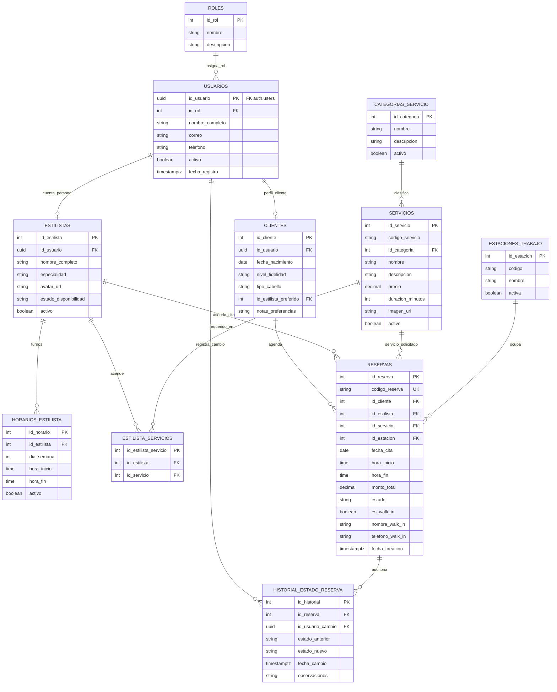
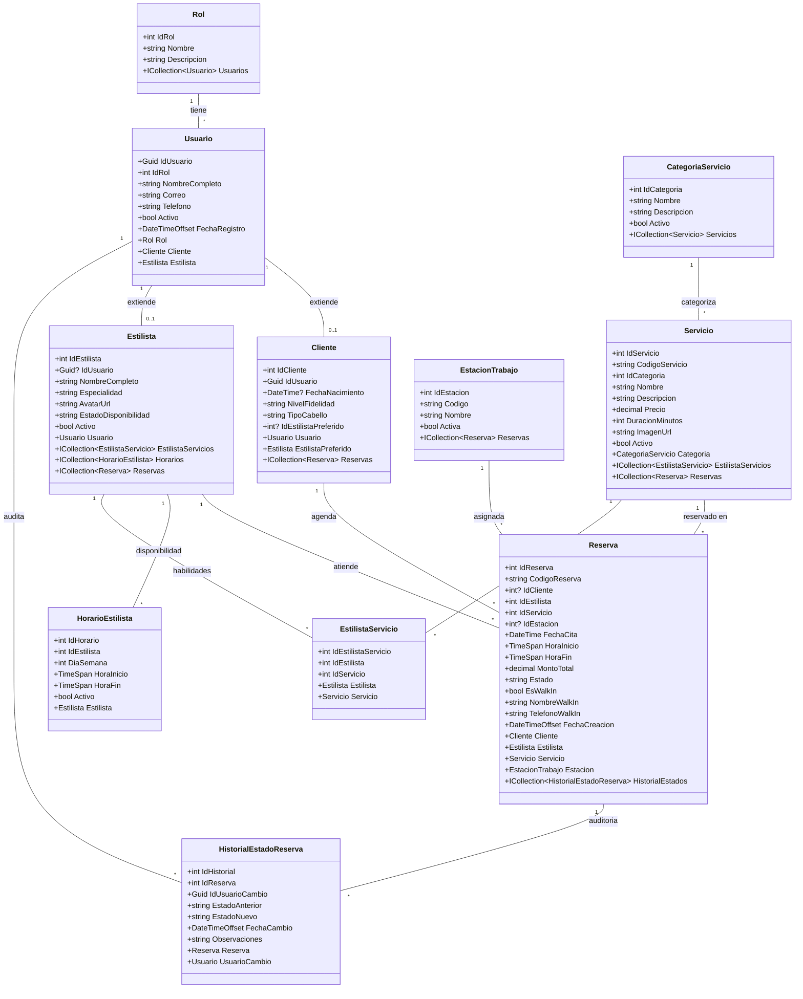

# Modelo y Diagrama de Base de Datos — Shushine Studio (Supabase / PostgreSQL)

Este documento contiene la arquitectura de datos relacional para **Shushine Studio** optimizada para **Supabase (PostgreSQL)**, cubriendo todos los requerimientos funcionales (RF01 - RF12), requerimientos no funcionales (RNF01 - RNF04), integración con **Supabase Auth** (`auth.users`), **Row Level Security (RLS)** y suscripciones en tiempo real (**Supabase Realtime**).

---

## 1. Código DBML (para dbdiagram.io / DiagramBD)

> **Instrucciones de uso en [dbdiagram.io](https://dbdiagram.io/):**
> 1. Ingresa a [https://dbdiagram.io/d](https://dbdiagram.io/).
> 2. Borra el código de ejemplo del panel izquierdo.
> 3. Pega el siguiente bloque de código DBML.
> 4. El diagrama visual ER se generará automáticamente en tiempo real con todas las tablas, columnas, tipos de datos y relaciones adaptadas a PostgreSQL/Supabase.

```dbml
// ==========================================
// SHUSHINE STUDIO - BASE DE DATOS (SUPABASE / POSTGRESQL)
// ==========================================

Table Roles {
  id_rol int [pk, increment]
  nombre varchar(50) [not null, unique, note: 'Cliente, Administrador, Recepcionista']
  descripcion varchar(200)
}

Table Usuarios {
  id_usuario uuid [pk, note: 'FK directa a auth.users(id)']
  id_rol int [not null, ref: > Roles.id_rol]
  nombre_completo varchar(150) [not null]
  correo varchar(150) [not null, unique]
  telefono varchar(20) [not null]
  activo boolean [not null, default: true]
  fecha_registro timestamptz [not null, default: `now()`]
}

Table Clientes {
  id_cliente int [pk, increment]
  id_usuario uuid [not null, unique, ref: - Usuarios.id_usuario]
  fecha_nacimiento date [null]
  nivel_fidelidad varchar(50) [default: 'Nivel Oro', note: 'Bronce, Plata, Oro']
  tipo_cabello varchar(100) [null, note: 'ej. Ondulado Fino - Tratado']
  id_estilista_preferido int [null, ref: > Estilistas.id_estilista]
  notas_preferencias varchar(500) [null]
}

Table CategoriasServicio {
  id_categoria int [pk, increment]
  nombre varchar(100) [not null, unique, note: 'Cabello, Uñas, Maquillaje, Spa']
  descripcion varchar(255)
  activo boolean [not null, default: true]
}

Table Servicios {
  id_servicio int [pk, increment]
  codigo_servicio varchar(20) [not null, unique, note: 'ej. SRV-C01, SRV-042']
  id_categoria int [not null, ref: > CategoriasServicio.id_categoria]
  nombre varchar(150) [not null, note: 'Tratamiento Capilar, Corte y Estilizado, etc.']
  descripcion text [not null]
  precio decimal(10,2) [not null]
  duracion_minutos int [not null, note: '45, 60, 90, 120 min']
  imagen_url varchar(300) [null]
  activo boolean [not null, default: true]
}

Table Estilistas {
  id_estilista int [pk, increment]
  id_usuario uuid [null, unique, ref: - Usuarios.id_usuario]
  nombre_completo varchar(150) [not null, note: 'Elena Gómez, Carlos Méndez, Sofia Valenzuela']
  especialidad varchar(150) [not null, note: 'Colorista & Cuidado Capilar, Estilismo, etc.']
  avatar_url varchar(300) [null]
  estado_disponibilidad varchar(30) [not null, default: 'Activo', note: 'Activo, Inactivo Temporal']
  activo boolean [not null, default: true]
}

Table EstilistaServicios {
  id_estilista_servicio int [pk, increment]
  id_estilista int [not null, ref: > Estilistas.id_estilista]
  id_servicio int [not null, ref: > Servicios.id_servicio]

  indexes {
    (id_estilista, id_servicio) [unique]
  }
}

Table HorariosEstilista {
  id_horario int [pk, increment]
  id_estilista int [not null, ref: > Estilistas.id_estilista]
  dia_semana int [not null, note: '1=Lunes, 7=Domingo']
  hora_inicio time [not null]
  hora_fin time [not null]
  activo boolean [not null, default: true]
}

Table EstacionesTrabajo {
  id_estacion int [pk, increment]
  codigo varchar(10) [not null, unique, note: 'E-01, E-02, E-03, E-04, E-05']
  nombre varchar(50) [not null, note: 'Corte, Color, Peinado, Uñas, Spa']
  activa boolean [not null, default: true]
}

Table Reservas {
  id_reserva int [pk, increment]
  codigo_reserva varchar(20) [not null, unique, note: 'ej. #ELX-8492']
  id_cliente int [null, ref: > Clientes.id_cliente, note: 'Nullable para walk-ins no registrados']
  id_estilista int [not null, ref: > Estilistas.id_estilista]
  id_servicio int [not null, ref: > Servicios.id_servicio]
  id_estacion int [null, ref: > EstacionesTrabajo.id_estacion]
  fecha_cita date [not null]
  hora_inicio time [not null]
  hora_fin time [not null]
  monto_total decimal(10,2) [not null]
  estado varchar(30) [not null, default: 'Pendiente', note: 'Pendiente, Completada, Cancelada, No Asistió']
  es_walk_in boolean [not null, default: false, note: 'RF10: Cliente presencial sin cita previa']
  nombre_walk_in varchar(150) [null]
  telefono_walk_in varchar(20) [null]
  notas varchar(500) [null]
  fecha_creacion timestamptz [not null, default: `now()`]

  indexes {
    (id_estilista, fecha_cita, hora_inicio) [name: 'idx_estilista_horario_reserva']
    (codigo_reserva) [unique]
  }
}

Table HistorialEstadoReserva {
  id_historial int [pk, increment]
  id_reserva int [not null, ref: > Reservas.id_reserva]
  id_usuario_cambio uuid [not null, ref: > Usuarios.id_usuario]
  estado_anterior varchar(30) [not null]
  estado_nuevo varchar(30) [not null]
  fecha_cambio timestamptz [not null, default: `now()`]
  observaciones varchar(255) [null]
}
```

---

## 2. Diagrama Entidad-Relación (Mermaid ER)

Visualizable directamente en Markdown, GitHub, Mermaid Live Editor o VS Code:



---

## 3. Diagrama de Clases del Modelo de Dominio (C# / Supabase Client)

Representa las entidades con sus tipos correspondientes a PostgreSQL / Supabase:



---

## 4. Script DDL para Supabase (PostgreSQL + RLS + Triggers)

```sql
-- =============================================
-- SHUSHINE STUDIO - SCRIPT DE BASE DE DATOS (SUPABASE / POSTGRESQL)
-- =============================================

-- Extensiones requeridas
CREATE EXTENSION IF NOT EXISTS "uuid-ossp";

-- 1. Tabla de Roles
CREATE TABLE public.roles (
    id_rol BIGINT GENERATED ALWAYS AS IDENTITY PRIMARY KEY,
    nombre VARCHAR(50) NOT NULL UNIQUE,
    descripcion VARCHAR(200) NULL
);

-- Insertar roles por defecto
INSERT INTO public.roles (nombre, descripcion) VALUES
('Cliente', 'Usuario final que consulta y solicita citas'),
('Administrador', 'Control total de configuraciones y usuarios'),
('Recepcionista', 'Gestiona agenda y atención presencial/walk-ins');

-- 2. Tabla de Usuarios (Vinculada a auth.users de Supabase)
CREATE TABLE public.usuarios (
    id_usuario UUID PRIMARY KEY REFERENCES auth.users(id) ON DELETE CASCADE,
    id_rol BIGINT NOT NULL REFERENCES public.roles(id_rol),
    nombre_completo VARCHAR(150) NOT NULL,
    correo VARCHAR(150) NOT NULL UNIQUE,
    telefono VARCHAR(20) NOT NULL,
    activo BOOLEAN NOT NULL DEFAULT TRUE,
    fecha_registro TIMESTAMPTZ NOT NULL DEFAULT NOW()
);

-- 3. Tabla de Estilistas
CREATE TABLE public.estilistas (
    id_estilista BIGINT GENERATED ALWAYS AS IDENTITY PRIMARY KEY,
    id_usuario UUID NULL UNIQUE REFERENCES public.usuarios(id_usuario) ON DELETE SET NULL,
    nombre_completo VARCHAR(150) NOT NULL,
    especialidad VARCHAR(150) NOT NULL,
    avatar_url VARCHAR(300) NULL,
    estado_disponibilidad VARCHAR(30) NOT NULL DEFAULT 'Activo',
    activo BOOLEAN NOT NULL DEFAULT TRUE
);

-- 4. Tabla de Clientes
CREATE TABLE public.clientes (
    id_cliente BIGINT GENERATED ALWAYS AS IDENTITY PRIMARY KEY,
    id_usuario UUID NOT NULL UNIQUE REFERENCES public.usuarios(id_usuario) ON DELETE CASCADE,
    fecha_nacimiento DATE NULL,
    nivel_fidelidad VARCHAR(50) NOT NULL DEFAULT 'Nivel Oro',
    tipo_cabello VARCHAR(100) NULL,
    id_estilista_preferido BIGINT NULL REFERENCES public.estilistas(id_estilista) ON DELETE SET NULL,
    notas_preferencias VARCHAR(500) NULL
);

-- 5. Categorías de Servicio
CREATE TABLE public.categorias_servicio (
    id_categoria BIGINT GENERATED ALWAYS AS IDENTITY PRIMARY KEY,
    nombre VARCHAR(100) NOT NULL UNIQUE,
    descripcion VARCHAR(255) NULL,
    activo BOOLEAN NOT NULL DEFAULT TRUE
);

-- 6. Servicios
CREATE TABLE public.servicios (
    id_servicio BIGINT GENERATED ALWAYS AS IDENTITY PRIMARY KEY,
    codigo_servicio VARCHAR(20) NOT NULL UNIQUE,
    id_categoria BIGINT NOT NULL REFERENCES public.categorias_servicio(id_categoria),
    nombre VARCHAR(150) NOT NULL,
    descripcion TEXT NOT NULL,
    precio DECIMAL(10,2) NOT NULL,
    duracion_minutos INT NOT NULL,
    imagen_url VARCHAR(300) NULL,
    activo BOOLEAN NOT NULL DEFAULT TRUE
);

-- 7. EstilistaServicios (Tabla Intermedia N:M)
CREATE TABLE public.estilista_servicios (
    id_estilista_servicio BIGINT GENERATED ALWAYS AS IDENTITY PRIMARY KEY,
    id_estilista BIGINT NOT NULL REFERENCES public.estilistas(id_estilista) ON DELETE CASCADE,
    id_servicio BIGINT NOT NULL REFERENCES public.servicios(id_servicio) ON DELETE CASCADE,
    CONSTRAINT uq_estilista_servicio UNIQUE (id_estilista, id_servicio)
);

-- 8. Horarios de Estilista
CREATE TABLE public.horarios_estilista (
    id_horario BIGINT GENERATED ALWAYS AS IDENTITY PRIMARY KEY,
    id_estilista BIGINT NOT NULL REFERENCES public.estilistas(id_estilista) ON DELETE CASCADE,
    dia_semana INT NOT NULL CHECK (dia_semana BETWEEN 1 AND 7),
    hora_inicio TIME NOT NULL,
    hora_fin TIME NOT NULL,
    activo BOOLEAN NOT NULL DEFAULT TRUE
);

-- 9. Estaciones de Trabajo
CREATE TABLE public.estaciones_trabajo (
    id_estacion BIGINT GENERATED ALWAYS AS IDENTITY PRIMARY KEY,
    codigo VARCHAR(10) NOT NULL UNIQUE,
    nombre VARCHAR(50) NOT NULL,
    activa BOOLEAN NOT NULL DEFAULT TRUE
);

-- 10. Reservas (Citas)
CREATE TABLE public.reservas (
    id_reserva BIGINT GENERATED ALWAYS AS IDENTITY PRIMARY KEY,
    codigo_reserva VARCHAR(20) NOT NULL UNIQUE,
    id_cliente BIGINT NULL REFERENCES public.clientes(id_cliente) ON DELETE SET NULL,
    id_estilista BIGINT NOT NULL REFERENCES public.estilistas(id_estilista),
    id_servicio BIGINT NOT NULL REFERENCES public.servicios(id_servicio),
    id_estacion BIGINT NULL REFERENCES public.estaciones_trabajo(id_estacion) ON DELETE SET NULL,
    fecha_cita DATE NOT NULL,
    hora_inicio TIME NOT NULL,
    hora_fin TIME NOT NULL,
    monto_total DECIMAL(10,2) NOT NULL,
    estado VARCHAR(30) NOT NULL DEFAULT 'Pendiente' CHECK (estado IN ('Pendiente', 'Completada', 'Cancelada', 'No Asistió')),
    es_walk_in BOOLEAN NOT NULL DEFAULT FALSE,
    nombre_walk_in VARCHAR(150) NULL,
    telefono_walk_in VARCHAR(20) NULL,
    notas VARCHAR(500) NULL,
    fecha_creacion TIMESTAMPTZ NOT NULL DEFAULT NOW()
);

-- 11. Historial de Cambios de Estado
CREATE TABLE public.historial_estado_reserva (
    id_historial BIGINT GENERATED ALWAYS AS IDENTITY PRIMARY KEY,
    id_reserva BIGINT NOT NULL REFERENCES public.reservas(id_reserva) ON DELETE CASCADE,
    id_usuario_cambio UUID NOT NULL REFERENCES public.usuarios(id_usuario),
    estado_anterior VARCHAR(30) NOT NULL,
    estado_nuevo VARCHAR(30) NOT NULL,
    fecha_cambio TIMESTAMPTZ NOT NULL DEFAULT NOW(),
    observaciones VARCHAR(255) NULL
);

-- =============================================
-- ÍNDICES DE RENDIMIENTO Y REALTIME
-- =============================================
CREATE INDEX ix_reservas_disponibilidad ON public.reservas(id_estilista, fecha_cita, hora_inicio, hora_fin, estado);
CREATE INDEX ix_servicios_categoria ON public.servicios(id_categoria, activo);

-- =============================================
-- TRIGGER: SINCRONIZAR AUTH.USERS -> PUBLIC.USUARIOS Y PUBLIC.CLIENTES
-- =============================================
CREATE OR REPLACE FUNCTION public.handle_new_user()
RETURNS TRIGGER AS $$
DECLARE
    v_rol_cliente BIGINT;
BEGIN
    SELECT id_rol INTO v_rol_cliente FROM public.roles WHERE nombre = 'Cliente' LIMIT 1;

    INSERT INTO public.usuarios (id_usuario, id_rol, nombre_completo, correo, telefono)
    VALUES (
        NEW.id,
        COALESCE(v_rol_cliente, 1),
        COALESCE(NEW.raw_user_meta_data->>'nombre_completo', 'Usuario Registrado'),
        NEW.email,
        COALESCE(NEW.raw_user_meta_data->>'telefono', '')
    );

    INSERT INTO public.clientes (id_usuario, nivel_fidelidad)
    VALUES (NEW.id, 'Nivel Oro');

    RETURN NEW;
END;
$$ LANGUAGE plpgsql SECURITY DEFINER;

CREATE OR REPLACE TRIGGER on_auth_user_created
    AFTER INSERT ON auth.users
    FOR EACH ROW EXECUTE FUNCTION public.handle_new_user();

-- =============================================
-- ROW LEVEL SECURITY (RLS) - POLÍTICAS DE SEGURIDAD SUPABASE
-- =============================================
ALTER TABLE public.usuarios ENABLE ROW LEVEL SECURITY;
ALTER TABLE public.clientes ENABLE ROW LEVEL SECURITY;
ALTER TABLE public.reservas ENABLE ROW LEVEL SECURITY;
ALTER TABLE public.servicios ENABLE ROW LEVEL SECURITY;

-- Catálogo de servicios visible para todos
CREATE POLICY "Servicios son públicos" ON public.servicios
    FOR SELECT USING (activo = true);

-- Clientes solo pueden ver sus propias reservas
CREATE POLICY "Clientes ven sus propias reservas" ON public.reservas
    FOR SELECT USING (
        id_cliente IN (
            SELECT c.id_cliente FROM public.clientes c WHERE c.id_usuario = auth.uid()
        )
    );

-- Permitir a clientes crear reservas asociadas a su cuenta
CREATE POLICY "Clientes pueden crear reservas" ON public.reservas
    FOR INSERT WITH CHECK (
        id_cliente IN (
            SELECT c.id_cliente FROM public.clientes c WHERE c.id_usuario = auth.uid()
        )
    );

-- Habilitar replicación Realtime en reservas para actualización en vivo
ALTER PUBLICATION supabase_realtime ADD TABLE public.reservas;
