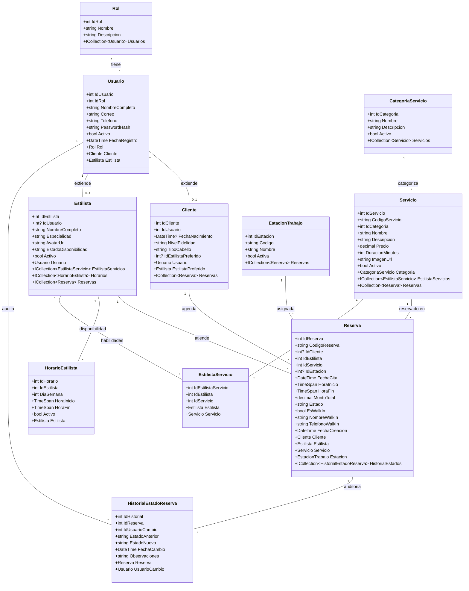

# Modelo y Diagrama de Base de Datos — Shushine Studio

Este documento contiene la arquitectura de datos relacional para **Shushine Studio** (SQL Server / ASP.NET Core EF Core), cubriendo todos los requerimientos funcionales (RF01 - RF12), requerimientos no funcionales (RNF01 - RNF04) y las pantallas del prototipo (Módulo Cliente y Módulo Administrador).

---

## 1. Código DBML (para dbdiagram.io / DiagramBD)

> **Instrucciones de uso en [dbdiagram.io](https://dbdiagram.io/):**
> 1. Ingresa a [https://dbdiagram.io/d](https://dbdiagram.io/d).
> 2. Borra el código de ejemplo del panel izquierdo.
> 3. Pega el siguiente bloque de código DBML.
> 4. El diagrama visual ER se generará automáticamente en tiempo real con todas las tablas, columnas, tipos de datos y relaciones.

```dbml
// ==========================================
// SHUSHINE STUDIO - BASE DE DATOS (SQL SERVER)
// ==========================================

Table Roles {
  id_rol int [pk, increment]
  nombre varchar(50) [not null, unique, note: 'Cliente, Administrador, Recepcionista']
  descripcion varchar(200)
}

Table Usuarios {
  id_usuario int [pk, increment]
  id_rol int [not null, ref: > Roles.id_rol]
  nombre_completo varchar(150) [not null]
  correo varchar(150) [not null, unique]
  telefono varchar(20) [not null]
  password_hash varchar(255) [not null]
  activo bit [not null, default: 1]
  fecha_registro datetime [not null, default: `now()`]
}

Table Clientes {
  id_cliente int [pk, increment]
  id_usuario int [not null, unique, ref: - Usuarios.id_usuario]
  fecha_nacimiento date [null]
  nivel_fidelidad varchar(50) [default: 'Nivel Oro', note: 'Bronce, Plata, Oro']
  tipo_cabello varchar(100) [null, note: 'ej. Ondulado Fino - Tratado']
  id_estilista_preferido int [null, ref: > Estilistas.id_estilista]
  notas_preferencias varchar(500) [null]
}

Table CategoriasServicio {
  id_categoria int [pk, increment]
  nombre varchar(100) [not null, unique, note: 'Cabello, Uñas, Maquillaje, Spa']
  descripcion varchar(255)
  activo bit [not null, default: 1]
}

Table Servicios {
  id_servicio int [pk, increment]
  codigo_servicio varchar(20) [not null, unique, note: 'ej. SRV-C01, SRV-042']
  id_categoria int [not null, ref: > CategoriasServicio.id_categoria]
  nombre varchar(150) [not null, note: 'Tratamiento Capilar, Corte y Estilizado, etc.']
  descripcion text [not null]
  precio decimal(10,2) [not null]
  duracion_minutos int [not null, note: '45, 60, 90, 120 min']
  imagen_url varchar(300) [null]
  activo bit [not null, default: 1]
}

Table Estilistas {
  id_estilista int [pk, increment]
  id_usuario int [null, unique, ref: - Usuarios.id_usuario]
  nombre_completo varchar(150) [not null, note: 'Elena Gómez, Carlos Méndez, Sofia Valenzuela']
  especialidad varchar(150) [not null, note: 'Colorista & Cuidado Capilar, Estilismo, etc.']
  avatar_url varchar(300) [null]
  estado_disponibilidad varchar(30) [not null, default: 'Activo', note: 'Activo, Inactivo Temporal']
  activo bit [not null, default: 1]
}

Table EstilistaServicios {
  id_estilista_servicio int [pk, increment]
  id_estilista int [not null, ref: > Estilistas.id_estilista]
  id_servicio int [not null, ref: > Servicios.id_servicio]

  indexes {
    (id_estilista, id_servicio) [unique]
  }
}

Table HorariosEstilista {
  id_horario int [pk, increment]
  id_estilista int [not null, ref: > Estilistas.id_estilista]
  dia_semana int [not null, note: '1=Lunes, 7=Domingo']
  hora_inicio time [not null]
  hora_fin time [not null]
  activo bit [not null, default: 1]
}

Table EstacionesTrabajo {
  id_estacion int [pk, increment]
  codigo varchar(10) [not null, unique, note: 'E-01, E-02, E-03, E-04, E-05']
  nombre varchar(50) [not null, note: 'Corte, Color, Peinado, Uñas, Spa']
  activa bit [not null, default: 1]
}

Table Reservas {
  id_reserva int [pk, increment]
  codigo_reserva varchar(20) [not null, unique, note: 'ej. #ELX-8492']
  id_cliente int [null, ref: > Clientes.id_cliente, note: 'Nullable para walk-ins no registrados']
  id_estilista int [not null, ref: > Estilistas.id_estilista]
  id_servicio int [not null, ref: > Servicios.id_servicio]
  id_estacion int [null, ref: > EstacionesTrabajo.id_estacion]
  fecha_cita date [not null]
  hora_inicio time [not null]
  hora_fin time [not null]
  monto_total decimal(10,2) [not null]
  estado varchar(30) [not null, default: 'Pendiente', note: 'Pendiente, Completada, Cancelada, No Asistió']
  es_walk_in bit [not null, default: 0, note: 'RF10: Cliente presencial sin cita previa']
  nombre_walk_in varchar(150) [null]
  telefono_walk_in varchar(20) [null]
  notas varchar(500) [null]
  fecha_creacion datetime [not null, default: `now()`]

  indexes {
    (id_estilista, fecha_cita, hora_inicio) [name: 'idx_estilista_horario_reserva']
    (codigo_reserva) [unique]
  }
}

Table HistorialEstadoReserva {
  id_historial int [pk, increment]
  id_reserva int [not null, ref: > Reservas.id_reserva]
  id_usuario_cambio int [not null, ref: > Usuarios.id_usuario]
  estado_anterior varchar(30) [not null]
  estado_nuevo varchar(30) [not null]
  fecha_cambio datetime [not null, default: `now()`]
  observaciones varchar(255) [null]
}
```

---

## 2. Diagrama Entidad-Relación (Mermaid ER)

Visualizable directamente en Markdown, GitHub, Mermaid Live Editor o VS Code:


---

## 3. Diagrama de Clases del Modelo de Dominio (Entity Framework Core / C#)

Representa las entidades de clases en ASP.NET Core con sus propiedades de navegación y cardinalidades:



---

## 4. Script DDL para Microsoft SQL Server

```sql
-- =============================================
-- CREACIÓN DE TABLAS - SHUSHINE STUDIO (SQL SERVER)
-- =============================================

CREATE TABLE Roles (
    id_rol INT IDENTITY(1,1) PRIMARY KEY,
    nombre VARCHAR(50) NOT NULL UNIQUE,
    descripcion VARCHAR(200) NULL
);

CREATE TABLE Usuarios (
    id_usuario INT IDENTITY(1,1) PRIMARY KEY,
    id_rol INT NOT NULL,
    nombre_completo VARCHAR(150) NOT NULL,
    correo VARCHAR(150) NOT NULL UNIQUE,
    telefono VARCHAR(20) NOT NULL,
    password_hash VARCHAR(255) NOT NULL,
    activo BIT NOT NULL DEFAULT 1,
    fecha_registro DATETIME NOT NULL DEFAULT GETDATE(),
    CONSTRAINT FK_Usuarios_Roles FOREIGN KEY (id_rol) REFERENCES Roles(id_rol)
);

CREATE TABLE Estilistas (
    id_estilista INT IDENTITY(1,1) PRIMARY KEY,
    id_usuario INT NULL UNIQUE,
    nombre_completo VARCHAR(150) NOT NULL,
    especialidad VARCHAR(150) NOT NULL,
    avatar_url VARCHAR(300) NULL,
    estado_disponibilidad VARCHAR(30) NOT NULL DEFAULT 'Activo',
    activo BIT NOT NULL DEFAULT 1,
    CONSTRAINT FK_Estilistas_Usuarios FOREIGN KEY (id_usuario) REFERENCES Usuarios(id_usuario)
);

CREATE TABLE Clientes (
    id_cliente INT IDENTITY(1,1) PRIMARY KEY,
    id_usuario INT NOT NULL UNIQUE,
    fecha_nacimiento DATE NULL,
    nivel_fidelidad VARCHAR(50) NOT NULL DEFAULT 'Nivel Oro',
    tipo_cabello VARCHAR(100) NULL,
    id_estilista_preferido INT NULL,
    notas_preferencias VARCHAR(500) NULL,
    CONSTRAINT FK_Clientes_Usuarios FOREIGN KEY (id_usuario) REFERENCES Usuarios(id_usuario),
    CONSTRAINT FK_Clientes_EstilistaPreferido FOREIGN KEY (id_estilista_preferido) REFERENCES Estilistas(id_estilista)
);

CREATE TABLE CategoriasServicio (
    id_categoria INT IDENTITY(1,1) PRIMARY KEY,
    nombre VARCHAR(100) NOT NULL UNIQUE,
    descripcion VARCHAR(255) NULL,
    activo BIT NOT NULL DEFAULT 1
);

CREATE TABLE Servicios (
    id_servicio INT IDENTITY(1,1) PRIMARY KEY,
    codigo_servicio VARCHAR(20) NOT NULL UNIQUE,
    id_categoria INT NOT NULL,
    nombre VARCHAR(150) NOT NULL,
    descripcion NVARCHAR(MAX) NOT NULL,
    precio DECIMAL(10,2) NOT NULL,
    duracion_minutos INT NOT NULL,
    imagen_url VARCHAR(300) NULL,
    activo BIT NOT NULL DEFAULT 1,
    CONSTRAINT FK_Servicios_Categorias FOREIGN KEY (id_categoria) REFERENCES CategoriasServicio(id_categoria)
);

CREATE TABLE EstilistaServicios (
    id_estilista_servicio INT IDENTITY(1,1) PRIMARY KEY,
    id_estilista INT NOT NULL,
    id_servicio INT NOT NULL,
    CONSTRAINT UQ_Estilista_Servicio UNIQUE (id_estilista, id_servicio),
    CONSTRAINT FK_ES_Estilistas FOREIGN KEY (id_estilista) REFERENCES Estilistas(id_estilista),
    CONSTRAINT FK_ES_Servicios FOREIGN KEY (id_servicio) REFERENCES Servicios(id_servicio)
);

CREATE TABLE HorariosEstilista (
    id_horario INT IDENTITY(1,1) PRIMARY KEY,
    id_estilista INT NOT NULL,
    dia_semana INT NOT NULL CHECK (dia_semana BETWEEN 1 AND 7),
    hora_inicio TIME NOT NULL,
    hora_fin TIME NOT NULL,
    activo BIT NOT NULL DEFAULT 1,
    CONSTRAINT FK_Horarios_Estilistas FOREIGN KEY (id_estilista) REFERENCES Estilistas(id_estilista)
);

CREATE TABLE EstacionesTrabajo (
    id_estacion INT IDENTITY(1,1) PRIMARY KEY,
    codigo VARCHAR(10) NOT NULL UNIQUE,
    nombre VARCHAR(50) NOT NULL,
    activa BIT NOT NULL DEFAULT 1
);

CREATE TABLE Reservas (
    id_reserva INT IDENTITY(1,1) PRIMARY KEY,
    codigo_reserva VARCHAR(20) NOT NULL UNIQUE,
    id_cliente INT NULL,
    id_estilista INT NOT NULL,
    id_servicio INT NOT NULL,
    id_estacion INT NULL,
    fecha_cita DATE NOT NULL,
    hora_inicio TIME NOT NULL,
    hora_fin TIME NOT NULL,
    monto_total DECIMAL(10,2) NOT NULL,
    estado VARCHAR(30) NOT NULL DEFAULT 'Pendiente' CHECK (estado IN ('Pendiente', 'Completada', 'Cancelada', 'No Asistió')),
    es_walk_in BIT NOT NULL DEFAULT 0,
    nombre_walk_in VARCHAR(150) NULL,
    telefono_walk_in VARCHAR(20) NULL,
    notas VARCHAR(500) NULL,
    fecha_creacion DATETIME NOT NULL DEFAULT GETDATE(),
    CONSTRAINT FK_Reservas_Clientes FOREIGN KEY (id_cliente) REFERENCES Clientes(id_cliente),
    CONSTRAINT FK_Reservas_Estilistas FOREIGN KEY (id_estilista) REFERENCES Estilistas(id_estilista),
    CONSTRAINT FK_Reservas_Servicios FOREIGN KEY (id_servicio) REFERENCES Servicios(id_servicio),
    CONSTRAINT FK_Reservas_Estaciones FOREIGN KEY (id_estacion) REFERENCES EstacionesTrabajo(id_estacion)
);

CREATE TABLE HistorialEstadoReserva (
    id_historial INT IDENTITY(1,1) PRIMARY KEY,
    id_reserva INT NOT NULL,
    id_usuario_cambio INT NOT NULL,
    estado_anterior VARCHAR(30) NOT NULL,
    estado_nuevo VARCHAR(30) NOT NULL,
    fecha_cambio DATETIME NOT NULL DEFAULT GETDATE(),
    observaciones VARCHAR(255) NULL,
    CONSTRAINT FK_Historial_Reservas FOREIGN KEY (id_reserva) REFERENCES Reservas(id_reserva),
    CONSTRAINT FK_Historial_Usuarios FOREIGN KEY (id_usuario_cambio) REFERENCES Usuarios(id_usuario)
);

-- Índices recomendados para consultas frecuentes y cálculo dinámico de disponibilidad
CREATE INDEX IX_Reservas_Disponibilidad ON Reservas(id_estilista, fecha_cita, hora_inicio, hora_fin, estado);
CREATE INDEX IX_Servicios_Categoria ON Servicios(id_categoria, activo);
```
